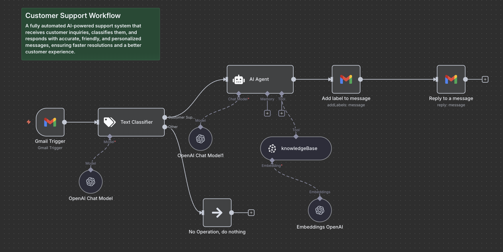

# Customer Support Workflow (n8n)

This repository contains an **AI-powered customer support workflow** built with [n8n](https://n8n.io/).  
It automatically handles incoming inquiries, classifies them into categories, and responds with **accurate, friendly, and personalized** messages — ensuring faster resolutions and a better customer experience.

## Workflow Overview
Below is a visual representation of the workflow:

*Figure: The n8n workflow that powers automated customer support, integrating AI for classification and response generation.*

